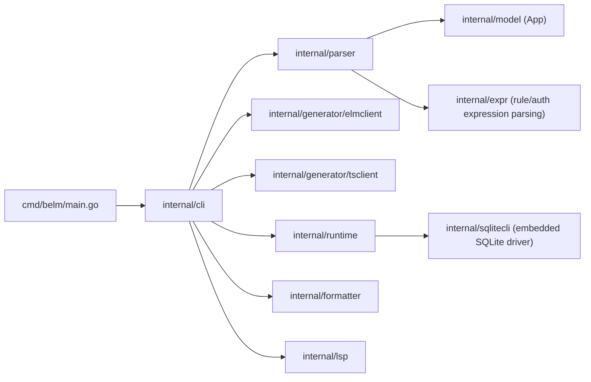
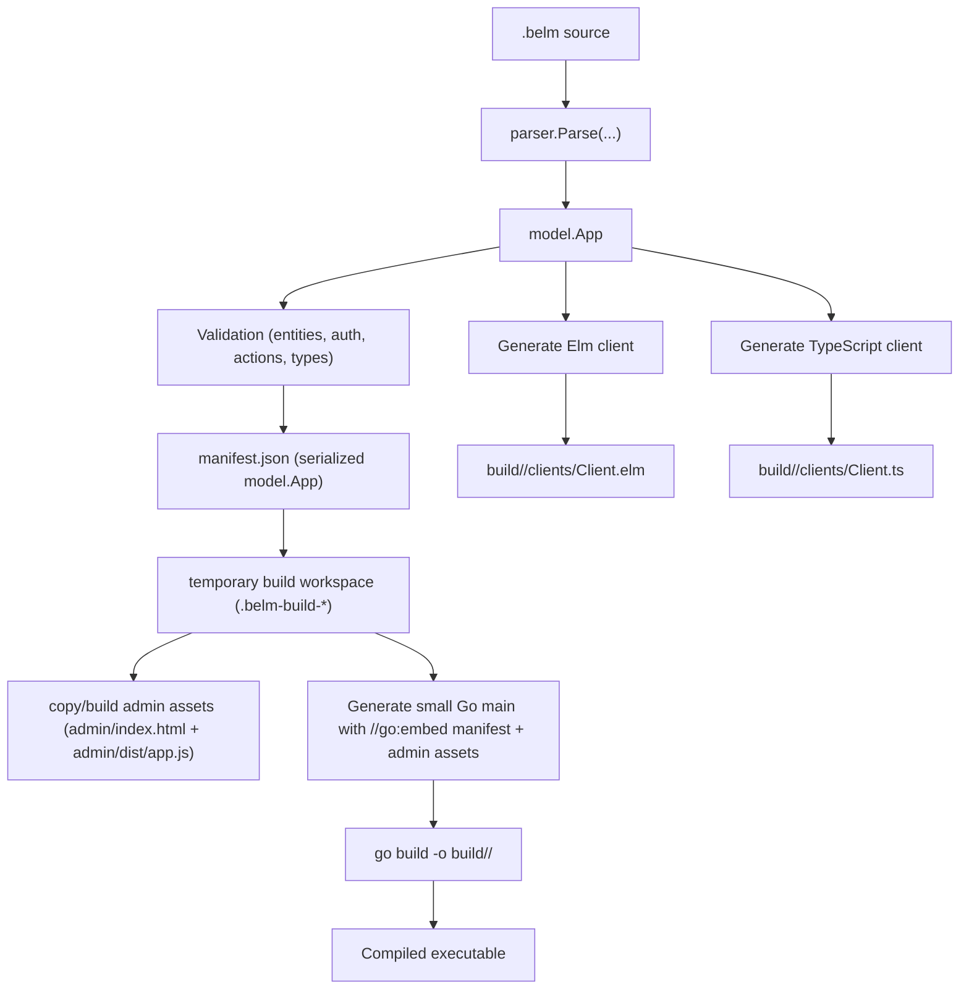

# Belm Advanced Guide

This document is the full Belm reference.

If you are new to Belm, start with the quick guide in [README.md](/Users/marcio/dev/github/belm/README.md).

Belm is a DSL for backend development inspired by [Elm](https://elm-lang.org) and [PocketBase](https://pocketbase.io), implemented in Go, with a strong focus on readability, simplicity and maintainability.

## Quick Examples

Belm is designed to be read top-to-bottom as a declarative app definition.

Example (`.belm`):

```belm
app TodoApi
port 4100
database "todo.db"

entity Todo {
  id: Int primary auto
  title: String
  done: Bool

  rule "Title must have at least 3 chars" when len(title) >= 3
  authorize list when auth_authenticated
  authorize create when auth_authenticated
}
```

Example with typed action:

```belm
type alias PlaceOrderInput =
  { userId : Int
  , total : Float
  }

action placeOrder {
  input: PlaceOrderInput

  create Order {
    userId: input.userId
    total: input.total
    status: "created"
  }

  create AuditLog {
    userId: input.userId
    event: "order created"
  }
}
```

Full examples:

- [examples/todo.belm](/Users/marcio/dev/github/belm/examples/todo.belm): minimal CRUD + auth-ready admin tools
- [examples/store.belm](/Users/marcio/dev/github/belm/examples/store.belm): full app with auth, admin role, actions, backups

## Goals

- Simple, declarative syntax (`entity`, `rule`, `authorize`, `auth`)
- Automatic REST CRUD
- SQLite as the database
- Email code login flow
- Rule-based authorization
- Safe automatic schema migrations
- Version-control friendly by design
- Integrated admin panel
- Built-in SQLite backup workflow
- Built-in monitoring and logging dashboards
- Embedded static frontend support

## Architecture (Go)

- [cmd/belm/main.go](/Users/marcio/dev/github/belm/cmd/belm/main.go): compiler/runtime CLI
- [internal/parser/parser.go](/Users/marcio/dev/github/belm/internal/parser/parser.go): `.belm` language parser
- [internal/expr/parser.go](/Users/marcio/dev/github/belm/internal/expr/parser.go): expression parser (`rule`/`authorize`)
- [internal/runtime](/Users/marcio/dev/github/belm/internal/runtime): HTTP server, auth/authz, and migrations
- [internal/sqlitecli/sqlitecli.go](/Users/marcio/dev/github/belm/internal/sqlitecli/sqlitecli.go): embedded SQLite access via Go driver (`modernc.org/sqlite`)

## Compiler Architecture

Belm has a single Go CLI binary (`belm`) that hosts multiple tools:

- compiler (`belm compile`)
- dev server with hot reload (`belm dev`)
- formatter (`belm format`)
- language server (`belm lsp`)

The compiler pipeline is centered on a shared typed AST/model (`model.App`), produced by the parser and reused by code generators and runtime embedding.

### High-level Module Map



### `belm compile` Build Flow



### What Is Inside the Generated Executable

At compile time, Belm embeds:

- `manifest.json` (compiled app model)
- `admin/index.html`
- `admin/dist/app.js`
- files from configured `public.dir` (when `public { ... }` is declared)

At runtime, the executable:

1. loads embedded `manifest.json`
2. initializes `runtime.New(app)` (expression compilation + migrations)
3. serves REST endpoints, auth, actions, system tools, and embedded admin assets

This means the final app binary is self-contained for server + admin UI.

## Compiler and Dev Commands

Compile `.belm` into an executable:

```bash
./belm compile examples/store.belm
```

Run development mode with hot reload:

```bash
./belm dev examples/store.belm
```

Dev mode behavior:

- watches the input `.belm` file for changes
- on save, recompiles and restarts the generated executable automatically
- opens Belm Admin on the first successful run
- keeps generated files in `build/<name>/`
- stop with `Ctrl+C`

Show Belm CLI version and build metadata:

```bash
./belm version
```

Default output location is `build/<name>/<name>` where `<name>` comes from input filename:

- `examples/store.belm` -> `build/store/store`

Run the compiled executable:

```bash
./build/store/store serve
./build/store/store backup
```

Optional output name:

```bash
./belm compile examples/store.belm bookstore
# output (binary): build/bookstore/bookstore
```

Dev mode also supports custom output name:

```bash
./belm dev examples/store.belm bookstore
```

Run API + Admin panel and open browser (from the compiled executable):

```bash
./build/store/store serve
```

## Code Formatting

Belm provides a canonical formatter (single official formatting style).

Format files in place:

```bash
./belm format examples/store.belm examples/todo.belm
```

Check formatting in CI (no writes):

```bash
./belm format --check examples/store.belm
```

Format from stdin:

```bash
cat examples/store.belm | ./belm format --stdin
```

## Auto-generated Clients

Belm generates client files under `clients/` inside the app build folder:

- Elm: `build/<name>/clients/<AppName>Client.elm`
- TypeScript: `build/<name>/clients/<AppName>Client.ts`

Both clients include:

- `schema` (entity metadata)
- CRUD functions per entity:
- `list<Entity>`
- `get<Entity>`
- `create<Entity>`
- `update<Entity>`
- `delete<Entity>`
- typed action functions:
- `run<Action>`
- auth endpoints, when auth is enabled:
- `requestCode`
- `login`
- `logout`
- `me`
- public backend version endpoint:
- `getVersion` (calls `GET /_belm/version`)

Elm client also exposes:

- `rowDecoder`

Usage example in Elm:

```elm
import StoreApiClient as Api

type Msg
    = GotUsers (Result Http.Error (List Api.Row))

load : Cmd Msg
load =
    Api.listUser
        { baseUrl = "http://localhost:4100", token = "" }
        GotUsers
```

Usage example in TypeScript:

```ts
import { Config, createBook, runPlaceBookOrder } from "./BookStoreApiClient";

const config: Config = {
  baseUrl: "http://localhost:4100",
  token: "<bearer-token>",
};

await createBook(config, {
  title: "Domain Modeling Made Functional",
  authorName: "Scott Wlaschin",
  isbn: "978-1-68050-254-1",
  price: 129.9,
  stock: 10,
});

await runPlaceBookOrder(config, {
  orderRef: "ORD-2026-0001",
  userId: 1,
  bookId: 1,
  quantity: 1,
  unitPrice: 129.9,
  lineTotal: 129.9,
  orderTotal: 129.9,
  notes: "first order",
});
```

## Admin Panel

An Admin panel (built with [Elm](https://elm-lang.org) and [elm-ui](https://github.com/mdgriffith/elm-ui)) is also provided:

- code: [admin/src/Main.elm](/Users/marcio/dev/github/belm/admin/src/Main.elm)
- docs: [admin/README.md](/Users/marcio/dev/github/belm/admin/README.md)

It uses `GET /_belm/schema` to discover entities and lets you list/create/update/delete records.

For admin users, the System area includes:

- performance metrics
- recent request logs (method, route, status, duration)
- SQL query traces per request (query text, rows, duration, errors)
- backup creation and backup listing

## VS Code Extension (Syntax + LSP + Format)

A VS Code language extension for `.belm` files is available in:

- [vscode-belm](/Users/marcio/dev/github/belm/vscode-belm)

It provides:

- syntax highlighting
- snippets/autocomplete templates
- LSP diagnostics
- LSP keyword completion
- go to definition
- find references
- rename symbol
- hover docs
- document symbols (Outline)
- quick fixes (code actions)
- document formatting (`Format Document` and `formatOnSave`)

## Language Syntax

Minimal example:

```belm
app TodoApi
port 4100
database "todo.db"

entity Todo {
  id: Int primary auto
  title: String
  done: Bool
  rule "Title must have at least 3 chars" when len(title) >= 3
}
```

### Statements

- `app <Name>`
- `port <number>`
- `database "<sqlite_path>"`
- `public { ... }`
- `system { ... }`
- `auth { ... }`
- `entity <Name> { ... }`
- `type alias <Name> = { ... }`
- `action <actionName> { ... }`
- `input: <InputAlias>`
- `create <Entity> { field: value }`

Relative `database` paths are resolved from the process working directory (where you run the executable), not from the executable file directory.

### System Configuration

Use `system` for runtime-level controls.

```belm
system {
  request_logs_buffer 500
  http_max_request_body_mb 1
  auth_request_code_rate_limit_per_minute 5
  auth_login_rate_limit_per_minute 10
  security_frame_policy sameorigin
  security_referrer_policy strict-origin-when-cross-origin
  security_content_type_nosniff true
  sqlite_journal_mode wal
  sqlite_synchronous normal
  sqlite_foreign_keys true
  sqlite_busy_timeout_ms 5000
  sqlite_wal_autocheckpoint 1000
  sqlite_journal_size_limit_mb 64
  sqlite_mmap_size_mb 128
  sqlite_cache_size_kb 2000
}
```

`request_logs_buffer` controls how many recent requests stay in memory for the admin monitoring dashboard and `GET /_belm/request-logs`.

- default: `200`
- minimum: `10`
- maximum: `5000`

`http_max_request_body_mb` controls max HTTP request body size (including JSON payloads) and returns HTTP `413` when exceeded.

- default: `1`
- minimum: `1`
- maximum: `1024`

Auth rate-limit settings control auth endpoint attempts per minute (scoped by email + client host):

- `auth_request_code_rate_limit_per_minute` for `POST /auth/request-code`:
  - default: `5`
  - minimum: `1`
  - maximum: `10000`
- `auth_login_rate_limit_per_minute` for `POST /auth/login`:
  - default: `10`
  - minimum: `1`
  - maximum: `10000`

Security header settings apply to all endpoints:

- `security_frame_policy` (default `sameorigin`): `sameorigin | deny` (sets `X-Frame-Options`)
- `security_referrer_policy` (default `strict-origin-when-cross-origin`): `strict-origin-when-cross-origin | no-referrer`
- `security_content_type_nosniff` (default `true`): `true | false` (controls `X-Content-Type-Options: nosniff`)

SQLite settings are performance-first by default and can be overridden per app in `system`.

- `sqlite_journal_mode` (default `wal`): `wal | delete | truncate | persist | memory | off`
- `sqlite_synchronous` (default `normal`): `off | normal | full | extra`
- `sqlite_foreign_keys` (default `true`): `true | false`
- `sqlite_busy_timeout_ms` (default `5000`): range `0..600000`
- `sqlite_wal_autocheckpoint` (default `1000`): range `0..1000000` pages
- `sqlite_journal_size_limit_mb` (default `64`): range `-1..4096` (`-1` means unlimited)
- `sqlite_mmap_size_mb` (default `128`): range `0..16384`
- `sqlite_cache_size_kb` (default `2000`): range `0..1048576`

If you need a safer write profile, override only what you want, for example:

```belm
system {
  sqlite_synchronous full
}
```

### Public Static Frontend

Belm can embed frontend static files into the compiled executable.

```belm
public {
  dir "./frontend/dist"
  mount "/"
  spa_fallback "index.html"
}
```

Fields:

- `dir`: required directory containing static files
- `mount`: optional URL mount point (`"/"` by default)
- `spa_fallback`: optional fallback file for SPA routes (for example `index.html`)

Notes:

- `dir` is resolved relative to the `.belm` file location (or can be absolute).
- Public files are embedded into the compiled executable for simpler deployment.

Routing behavior:

1. API routes are resolved first.
2. If no API route matches, Belm tries static files from `public`.
3. If no static file matches and `spa_fallback` is configured, Belm serves the fallback for route-like paths (no file extension).
4. Otherwise, it returns `404`.

### Fields

`<fieldName>: <Type> [primary] [auto] [optional]`

Types:

- `Int`
- `String`
- `Bool`
- `Float`

Attributes:

- `primary`: primary key
- `auto`: auto-increment (usually with `Int primary`)
- `optional`: nullable field

If no primary key is provided, Belm automatically adds:

`id: Int primary auto`

## Typed Actions

Belm supports typed actions for multi-entity writes in a **single atomic transaction**.

```belm
type alias PlaceOrderInput =
  { userId : Int
  , total : Float
  , note : String
  }

action placeOrder {
  input: PlaceOrderInput

  create Order {
    userId: input.userId
    status: "created"
    total: input.total
    note: input.note
  }

  create AuditLog {
    userId: input.userId
    message: "order created"
  }
}
```

Behavior:

- compile-time type checks for action input and assigned entity fields
- friendly compile errors (`expects Float but got String`, missing required fields, unknown input fields)
- atomic execution (all steps succeed or all rollback)

## Business Rules (`rule`)

Inside `entity`:

```belm
rule "User must be 18 or older" when age >= 18
```

Operators:

- `and`, `or`, `not`
- `==`, `!=`, `>`, `>=`, `<`, `<=`
- `+`, `-`, `*`, `/`

Functions:

- `contains(text, part)`
- `startsWith(text, prefix)`
- `endsWith(text, suffix)`
- `len(value)`
- `matches(text, regex)`

Literals:

- `true`, `false`, `null`

If a rule fails, the API returns HTTP `422` with `error` and `details`.

## Authentication (`auth`)

Built-in email code login flow:

1. `POST /auth/request-code`
2. send the code by email
3. `POST /auth/login` (email + code) returns a bearer token
4. `POST /auth/logout` revokes the session

Authentication endpoints are always available, even when `auth { ... }` is not defined.
When `auth { ... }` is defined, Belm uses your configured user entity (`user_entity`, `email_field`, `role_field`).
When `auth { ... }` is not defined, Belm still provides a built-in auth user store automatically.
Auth endpoints are rate-limited by default (`request-code`: `5/min`, `login`: `10/min`) and can be tuned in `system`.

For first-login flows, `request-code` can auto-create the auth user when the selected `user_entity`
only requires inferable fields (for example `email` and `role`).

Configuration:

```belm
auth {
  user_entity User
  email_field email
  role_field role
  code_ttl_minutes 10
  session_ttl_hours 24
  email_transport console
  email_from "no-reply@store.local"
  email_subject "Your StoreApi login code"
  dev_expose_code true
}
```

Numeric auth options:

- `code_ttl_minutes` default `10`, range `1..1440`
- `session_ttl_hours` default `24`, range `1..8760`
- `dev_expose_code` default `false` (set to `true` only for local development)

Recommended framework pattern:

- keep auth identities in a dedicated `User` entity (table: `users`)
- use `auth_email` or `auth_user_id` in `authorize` expressions for ownership checks

`email_transport`:

- `console`: prints code in logs
- `sendmail`: uses local binary (`sendmail_path`)

## System Admin Features

System features use the same app authentication session (`/auth/*`) and check `role == "admin"`.

System endpoints:

- `GET /_belm/version`
- `GET /_belm/version/admin` (role admin)
- `GET /_belm/perf`
- `GET /_belm/request-logs`
- `POST /_belm/backups`
- `GET /_belm/backups`

## Authorization (`authorize`)

Per CRUD operation:

```belm
authorize list when isRole("admin")
authorize get when auth_authenticated and (id == auth_user_id or isRole("admin"))
authorize create when true
authorize update when auth_authenticated and (id == auth_user_id or isRole("admin"))
authorize delete when isRole("admin")
```

Context available in authorization expressions:

- `auth_authenticated`
- `auth_email`
- `auth_user_id`
- `auth_role`
- entity fields (`id`, `userId`, etc.)

Extra function:

- `isRole("admin")`

## Generated Endpoints

For each entity `X`:

- `GET /xs`
- `GET /xs/:id`
- `POST /xs`
- `PUT /xs/:id`
- `PATCH /xs/:id`
- `DELETE /xs/:id`

Always:

- `GET /health`
- `GET /_belm/admin`
- `GET /_belm/schema`
- `GET /_belm/version`

Auth endpoints:

- `POST /auth/request-code`
- `POST /auth/login`
- `POST /auth/logout`
- `GET /auth/me`
- `POST /_belm/bootstrap-admin` (first admin setup)
- `GET /_belm/version/admin` (role admin)
- `GET /_belm/perf` (role admin)
- `GET /_belm/request-logs` (role admin)
- `POST /_belm/backups` (role admin)
- `GET /_belm/backups` (role admin)

`POST /_belm/bootstrap-admin` sends a verification code for the first user setup.
The user gets admin role only after a successful `POST /auth/login` with that code.

For each typed action `myAction`:

- `POST /actions/myAction`

## Migrations

Migrations run automatically on startup.

Automatic behavior:

- creates missing tables
- adds new optional columns
- keeps authentication and session storage ready automatically
- tracks applied schema changes

Blocked (manual migration required):

- column type changes
- primary key changes
- nullability changes
- adding required fields to existing tables
- adding primary/auto columns to existing tables

When blocked, the server fails at startup with a clear error message.

## Full Example

See [examples/store.belm](/Users/marcio/dev/github/belm/examples/store.belm), which already includes:

- business rules (email validation, role checks, stock/order constraints, etc.)
- email code auth
- role/ownership authorization with dedicated auth users
- entities: `User`, `Book`, `Order`, `OrderItem`, `AuditLog`
- typed action: `placeBookOrder`
